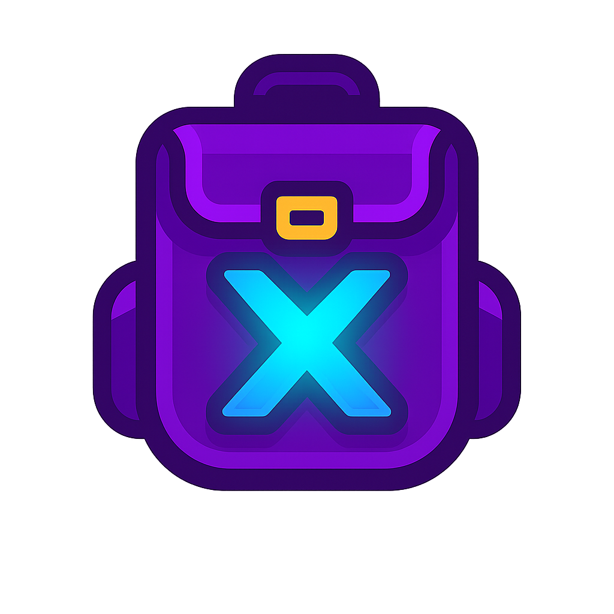

# InventoryX - Next.js

<div style="display: flex; align-items: center; gap: 16px;">
  
  <p>Uma interface de inventário gamificada para organizar suas ferramentas de produtividade, construída com <strong>Next.js 14</strong>, <strong>React</strong> e <strong>Tailwind CSS</strong>.</p>
</div>


## ✨ Características

- **Interface Gamificada**: Sistema de níveis, XP e raridades de itens
- **Drag & Drop**: Reorganize ferramentas arrastando e soltando
- **Atmosfera Musical**: Player integrado com músicas Lo-Fi para foco
- **Visualizações Múltiplas**: Modo grid e lista
- **Busca Inteligente**: Filtre ferramentas por nome ou categoria
- **Design Responsivo**: Funciona perfeitamente em desktop e mobile
- **TypeScript**: Tipagem completa para melhor experiência de desenvolvimento

## 🚀 Tecnologias

- **Next.js 14** - Framework React com App Router
- **TypeScript** - Tipagem estática
- **Tailwind CSS** - Estilização utilitária
- **Lucide React** - Ícones modernos
- **React Hooks** - Gerenciamento de estado

## 📦 Instalação

1. **Clone o repositório:**
```bash
git clone <seu-repositorio>
cd inventory-x-nextjs
```

2. **Instale as dependências:**
```bash
npm install
# ou
yarn install
# ou
pnpm install
```

3. **Execute o servidor de desenvolvimento:**
```bash
npm run dev
# ou
yarn dev
# ou
pnpm dev
```

4. **Abra o navegador:**
Acesse [http://localhost:3000](http://localhost:3000) para ver o resultado.

## 🎮 Como Usar

### Inventário
- **Grid View**: Visualize todas as ferramentas em uma grade 6x8
- **List View**: Visualize em formato de lista com mais detalhes
- **Drag & Drop**: Arraste ferramentas para reorganizar o inventário
- **Slot Numbers**: Cada slot é numerado de 1 a 48

### Sistema de Raridade
- **Common** (Comum): Ferramentas básicas - borda cinza
- **Rare** (Raro): Ferramentas úteis - borda ciano
- **Epic** (Épico): Ferramentas avançadas - borda roxa
- **Legendary** (Lendário): Ferramentas excepcionais - borda dourada com gradiente

### Atmosfera Musical
- **Tracks Pré-definidas**: 5 playlists Lo-Fi para diferentes ambientes
- **YouTube Personalizado**: Adicione seus próprios links do YouTube
- **Controle de Volume**: Ajuste o volume da música ambiente
- **Play/Pause Rápido**: Controles de reprodução integrados

### Busca e Filtros
- **Busca por Nome**: Digite o nome da ferramenta
- **Busca por Categoria**: Filtre por Produtividade, Segurança, Utilitários
- **Estatísticas**: Veja quantos itens você tem por categoria

## 🏗️ Estrutura do Projeto

```
inventory-x-nextjs/
├── app/
│   ├── globals.css          # Estilos globais
│   ├── layout.tsx          # Layout raiz
│   └── page.tsx            # Página principal
├── components/
│   └── HeroInventory.tsx   # Componente principal
├── public/
│   └── favicon.ico         # Ícone do site
├── next.config.js          # Configuração Next.js
├── tailwind.config.js      # Configuração Tailwind
├── tsconfig.json          # Configuração TypeScript
└── package.json           # Dependências
```

## 🎨 Personalização

### Adicionando Novas Ferramentas

Edite o array `initialTools` em `components/HeroInventory.tsx`:

```typescript
const initialTools: Tool[] = [
  {
    slot: 0, // Posição no grid (0-47)
    id: 'minha-ferramenta',
    name: 'Minha Ferramenta',
    icon: '🛠️', // Emoji
    rarity: 'epic', // common | rare | epic | legendary
    category: 'Produtividade'
  }
];
```

### Modificando Cores de Raridade

Ajuste as funções `getRarityColor` e `getRarityGlow` para personalizar as cores:

```typescript
const getRarityColor = (rarity: string): string => {
  const colors: Record<string, string> = {
    common: 'border-gray-300 bg-gray-50',
    rare: 'border-cyan-400 bg-cyan-50',
    epic: 'border-purple-400 bg-purple-50',
    legendary: 'border-yellow-400 bg-gradient-to-br from-yellow-50 to-orange-50'
  };
  return colors[rarity] || colors.common;
};
```

### Adicionando Músicas

Adicione novas tracks ao array `lofiTracks`:

```typescript
const lofiTracks: Track[] = [
  {
    id: 6,
    name: 'Nova Música',
    artist: 'Artista',
    duration: '1:30:00',
    url: 'https://youtube.com/watch?v=...'
  }
];
```

## 🚀 Deploy

### Vercel (Recomendado)

1. Faça push do código para o GitHub
2. Conecte seu repositório na [Vercel](https://vercel.com)
3. Deploy automático a cada push!

### Netlify

1. Build do projeto: `npm run build`
2. Faça upload da pasta `out/` para o Netlify

### Docker

```dockerfile
FROM node:18-alpine
WORKDIR /app
COPY package*.json ./
RUN npm install
COPY . .
RUN npm run build
EXPOSE 3000
CMD ["npm", "start"]
```

## 🔧 Scripts Disponíveis

- `npm run dev` - Servidor de desenvolvimento
- `npm run build` - Build de produção
- `npm run start` - Servidor de produção
- `npm run lint` - Verificação de código

## 📱 Responsividade

O projeto é totalmente responsivo:
- **Desktop**: Layout completo com sidebar
- **Tablet**: Sidebar oculta, grid adaptado
- **Mobile**: Layout empilhado, controles otimizados

## 🤝 Contribuição

1. Fork o projeto
2. Crie uma branch: `git checkout -b minha-feature`
3. Faça commit: `git commit -m 'Minha nova feature'`
4. Push: `git push origin minha-feature`
5. Abra um Pull Request

## 📄 Licença

Este projeto está sob a licença MIT. Veja o arquivo [LICENSE](LICENSE) para mais detalhes.

## 🆘 Suporte

Se você encontrar algum problema ou tiver dúvidas:

1. Verifique os [Issues](https://github.com/seu-usuario/inventory-x-nextjs/issues) existentes
2. Abra um novo Issue com detalhes do problema
3. Inclua informações do seu ambiente (OS, Node.js, navegador)


🔧 Resolver Carregamento Infinito - Next.js
🚨 Passos Imediatos
1. Limpar Cache e Reinstalar
bash# Delete as pastas de cache
rm -rf .next
rm -rf node_modules
rm -rf package-lock.json

# Reinstale as dependências
npm install

# Rode novamente
npm run dev

---

Feito com ❤️ e ☕ para a comunidade de desenvolvedores!